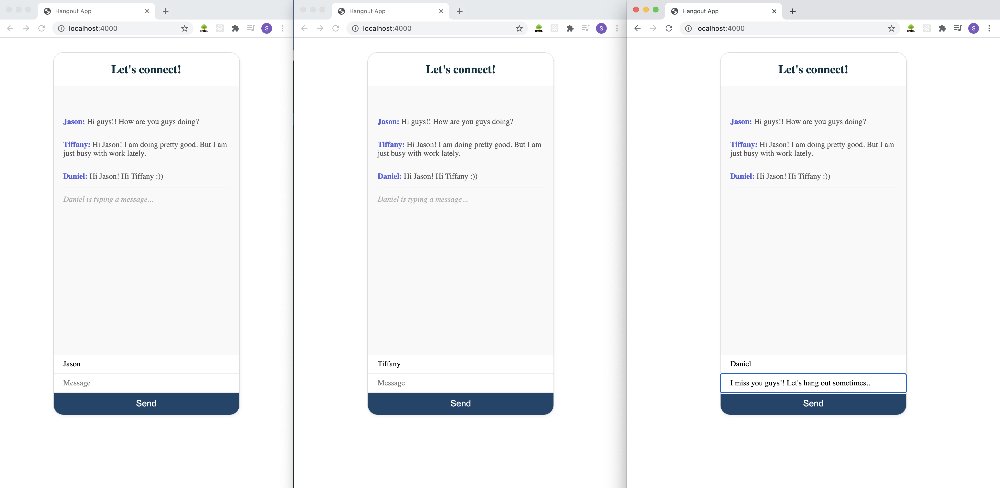

# HangoutApp

<li>Run on Terminal: <b>nodemon index.js </b></li>

<li>Run on Browser: <b>localhost:4000</b></li>  

Click here: <a href="Demo/Screen Recording 2021-01-24 at 1.13.59 PM.mov"><b>DEMO<b></a>

